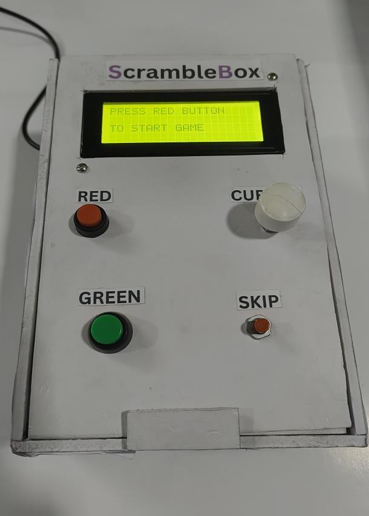
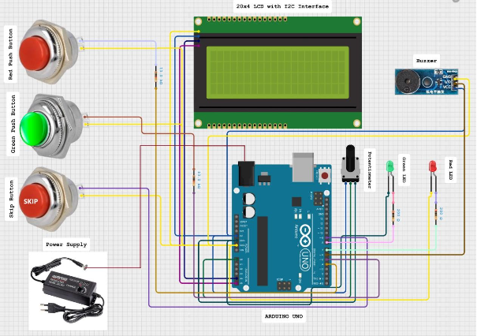

# 🎮 ScrambleBox – Arduino-Based Word Jumble Game Console

## Overview

**ScrambleBox** is an Arduino-based interactive word jumble game that combines embedded systems and educational gameplay.
The system challenges players to unscramble words using physical controls, demonstrating real-time hardware–software interaction through a standalone gaming console.

This project showcases practical applications of **Arduino programming, hardware interfacing, and user interaction design** in an educational embedded system.

---

## 🧩 Prototype



---

## 🎥 Project Demo

Watch the working device demonstration:

[▶️ ScrambleBox Working Video](media/demo.mp4)

---

## ✨ Features

* Interactive word unscrambling gameplay
* Category selection (Animals / Countries)
* Randomized word scrambling algorithm
* Performance-based scoring system
* Hint mechanism for assisted gameplay
* 20×4 LCD real-time display
* LED and buzzer feedback
* Potentiometer-based cursor control
* Standalone hardware gaming console

---

## ⚙️ System Architecture



The Arduino Uno acts as the central controller, handling:

* User input from buttons and potentiometer
* Word scrambling and game logic
* LCD updates and score display
* Audio and visual feedback

The working principle and system design are detailed in the project report (Chapter 3) .

---

## 🔧 Hardware Components

* Arduino Uno
* 20×4 LCD Display with I2C module
* Push buttons (user input)
* Potentiometer (cursor movement)
* LEDs (status indication)
* Buzzer (audio feedback)
* Resistors & Breadboard
* 12V Power Adapter

---

## ▶️ How to Play

1. Power on the device.
2. Press the **Red Button** to start.
3. Select a category.
4. A scrambled word appears on the LCD.
5. Move cursor using the potentiometer.
6. Swap letters using buttons.
7. Use hint option if required.
8. Final score is displayed after all rounds.

---

## 📁 Repository Structure

```
SCRAMBLEBOX/
│
├── src/
│   └── code.ino
│
├── media/
│   ├── prototype.jpg
│   └── demo.mp4
│
├── diagrams/
│   └── circuit_diagram.png
│
├── docs/
│   └── project_report.pdf
│
├── README.md
└── LICENSE
```

---

## 👨‍💻 My Contributions

* Developed Arduino game logic and interaction flow
* Implemented word scrambling and scoring system
* Integrated LCD display and input controls
* Hardware assembly and testing
* Debugging and performance validation

---

## 🎓 Academic Context

Developed as a **B.Tech Mini Project** in Electronics and Communication Engineering
Sree Chitra Thirunal College of Engineering, Thiruvananthapuram.

---

## 👥 Team

* Hashim S N
* Joshua Felix
* Muneera S

---

## 📄 License

MIT License — intended for academic and learning purposes.
